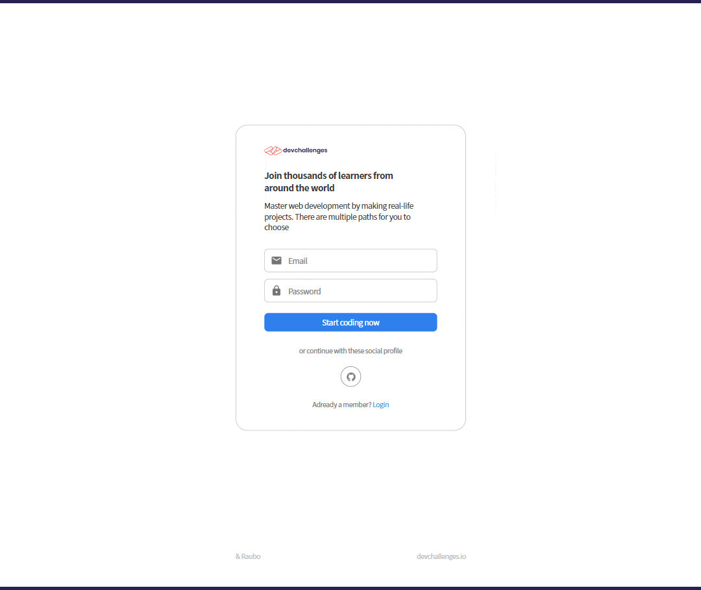

<h1 align="center">Authentication App</h1>

<div align="center">
   Solution for a challenge from  <a href="http://devchallenges.io" target="_blank">Devchallenges.io</a>.
</div>

<div align="center">
  <h3>
    <!-- <a href="https://{your-demo-link.your-domain}">
      Demo
    </a>
    <span> | </span> -->
    <a href="https://github.com/RauboLuk/Authentication-App">
      Solution
    </a>
    <span> | </span>
    <a href="https://devchallenges.io/challenges/N1fvBjQfhlkctmwj1tnw">
      Challenge
    </a>
  </h3>
</div>

<!-- TABLE OF CONTENTS -->

## Table of Contents

- [Overview](#overview)
  - [Built With](#built-with)
- [Features](#features)
- [How to use](#how-to-use)
- [Contact](#contact)
- [Acknowledgements](#acknowledgements)

<!-- OVERVIEW -->

## Overview


ETC: ~75h

### Built With

- [Create React App](https://create-react-app.dev/)
- [Express](https://expressjs.com/)
- [mongoose](https://mongoosejs.com/)
- [React](https://reactjs.org/)
- [Redux](https://redux.js.org/)
- [Redux Toolkit](https://redux-toolkit.js.org/)
<!-- - [axiox](https://axios-http.com/)
- [bcrypt](https://www.npmjs.com/package/bcrypt)
- [cookie-parser](https://www.npmjs.com/package/cookie-parser)
- [cors](https://www.npmjs.com/package/cors)
- [Chance](https://chancejs.com/)
- [cross-env](https://www.npmjs.com/package/cross-env)
- [Cypress](https://www.cypress.io/)
- [dotenv](https://www.npmjs.com/package/dotenv)
- [express-fileupload](https://www.npmjs.com/package/express-fileupload)
- [Jest](https://jestjs.io/)
- [jsonwebtoken](https://www.npmjs.com/package/jsonwebtoken)
- [nodemon](https://www.npmjs.com/package/nodemon)
- [React Hook Form](https://react-hook-form.com/)
- [React Router](https://reactrouter.com/)
- [supertest](https://www.npmjs.com/package/supertest)
- [yup](https://www.npmjs.com/package/yup) -->

## Features

This application/site was created as a submission to a [DevChallenges](https://devchallenges.io/challenges) challenge. The [challenge](https://devchallenges.io/challenges/N1fvBjQfhlkctmwj1tnw) was to build an application to complete the given user stories:

- [x] User story: I can register a new account
- [x] User story: I can log in
- [x] User story: I can log in or register with at least one of the following services: Google, Facebook, Twitter or Github
- [x] User story: I can sign out
- [x] User story: I can see my profile details
- [x] User story: I can edit my details including: photo, name, bio, phone, email and password
- [x] User story: I can upload a new photo

## How To Use

<!-- Example: -->

To clone and run this application, you'll need [Git](https://git-scm.com) and [Node.js](https://nodejs.org/en/download/) (which comes with [npm](http://npmjs.com)) installed on your computer. From your command line:

### Run the project

Authentication app holds two main folders `server` and `client`.

### server

create `.env` inside `./server` file with data (check `.env.example`)

```bash
# install packages
cd server && npm install

# start server
npm start
```

### client

From another terminal window:

```bash
# install packages
cd client && npm install

# start React app
npm start
```

## Acknowledgements

<!-- This section should list any articles or add-ons/plugins that helps you to complete the project. This is optional but it will help you in the future. For example -->

- [::first-letter](https://css-tricks.com/almanac/selectors/f/first-letter/)
- [Detect click outside React component](https://stackoverflow.com/a/59913572)
- [Handling Thunk Errors](https://redux-toolkit.js.org/api/createAsyncThunk#handling-thunk-errors)
- [How to start node app with development flag?](https://stackoverflow.com/a/53187835)
- [How to validate formik & Yup validation with file type and size?](https://github.com/formium/formik/issues/926#issuecomment-782733058)
- [material-ui, findDOMNode is deprecated in StrictMode](https://github.com/mui-org/material-ui/issues/13394)
- [Mocha, Arrow Functions](https://mochajs.org/#arrow-functions)
- [modify password with expressjs mongoose passport-local](https://stackoverflow.com/a/23969661)
- [node-oauth-example](https://github.com/sohamkamani/node-oauth-example/blob/master/index.js)
- [On css: if text line is break show dots](https://stackoverflow.com/a/17868554)
- [Passing variables to the next middleware using next() in Express.js](https://stackoverflow.com/a/38355597)
- [Thoughts on User Passwords in REST APIs](https://thecodebarbarian.com/thoughts-on-user-passwords-in-rest-apis)
- [Troubleshooting authorization request errors](https://docs.github.com/en/developers/apps/troubleshooting-authorization-request-errors)
- [Updating Documents in Mongoose](https://masteringjs.io/tutorials/mongoose/update)
- [Using HttpOnly cookies in React & Node | Storing JWT Tokens or SessionID Securely](https://youtu.be/a5Krfkfl9MM)
- [Validate phone number with Yup?](https://stackoverflow.com/questions/52483260/validate-phone-number-with-yup#comment110678061_53210158)
- [What HTTP error code to return for name already taken?](https://stackoverflow.com/a/24079327)
- [What's a good way to extend Error in JavaScript?](https://stackoverflow.com/a/32750746)
- [Yup, I want either an email or an empty string](https://github.com/jquense/yup/issues/58#issuecomment-231746266)
<!-- - [https://github.com/reduxjs/redux-toolkit/issues/520#issuecomment-699456947](https://github.com/reduxjs/redux-toolkit/issues/520#issuecomment-699456947) -->

## Contact

- GitHub [@RauboLuk](https://github.com/RauboLuk)
- Stack Overflow [@RauboLuk](https://stackoverflow.com/users/9185799/rauboluk)
